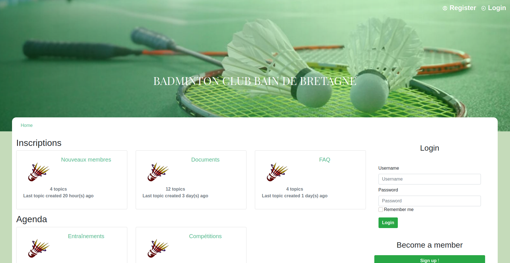

# Badminton-Club-Bain-de-Bretagne
BCBB - Small project about a BeCode Bulletin Board

# The project :

This forum is a small PHP project in order for our group to learn PHP, SQL and the free heroku web hosting service.

The site is available here : http://badminton-club-bb.herokuapp.com/

It is splitted in multiple subsections for which we used a particular terminology :

* A catagory called "board" contains "forums" which contain "topics" containing "posts".

The forum meets the features a classical forum have :

* user system and profile management

* possibility to add posts to an existing topic

* possibility to create new topics

## Link to exercice
https://github.com/becodeorg/LIE-Hamilton-4.25/tree/master/01-main-course/02-the-hills/02-bcbb/01-basics
https://github.com/becodeorg/LIE-Hamilton-4.25/tree/master/01-main-course/02-the-hills/02-bcbb/02-advanced

## Team

* **Bertrand** https://github.com/Bertrand2
* **Olivier**  https://github.com/OlivierCharlier
* **Aline**    https://github.com/Aline-Daems
* **Magali**   https://github.com/MagaliGarot
* **Emilie**   https://github.com/EmiliePieront

## Languages 
* HTML
* CSS
* PHP
* MySQL
* JavaScript
* Bootstrap

## Project structure
├── include  
│   ├── aside_lastpost.php 
│   ├── aside.php 
│   ├── bdd.php 
│   ├── boards.php 
│   ├── breadcrumb.php 
│   ├── ContentPost.php 
│   ├── editPost.php 
│   ├── emojiDisplayer.php 
│   ├── emojiPostUpdate.php 
│   ├── emojiSelector.php 
│   ├── emojiUpdater.php 
│   ├── footer.php 
│   ├── forum_rules.php 
│   ├── forums.php 
│   ├── gravatar.php 
│   ├── head.php 
│   ├── header.php 
│   ├── lockTopic.php 
│   ├── no_access.php 
│   ├── no_gravatar.php 
│   ├── no_post.php 
│   ├── no_session.php 
│   ├── no_user.php 
│   ├── password.php 
│   ├── postCreator.php 
│   ├── postdelete.php 
│   ├── postEditValidate.php 
│   ├── postValidate.php 
│   ├── profile_editor.php 
│   ├── profile_gravatar.php 
│   ├── profilePicture.php 
│   ├── profilePictureRadioButton.php 
│   ├── signup.php 
│   ├── topicCreator.php 
│   ├── user_gravatar.php 
│   ├── user_profile.php 
│   └── user.php 
├── sass 
│   ├── aside.css 
│   ├── emojis.css 
│   ├── forum.css 
│   ├── posts.css 
│   ├── style.css 
│   ├── style.css.map 
│   ├── style.scss 
│   └── up_style.css 
├── script 
│   ├── profile.js 
│   └── reactions.js 
├── error_404.php 
├── destroy_session.php 
├── forum.php 
├── index.php 
├── modifProfile.php 
├── newTopic.php 
├── posts.php 
├── profile.php 
├── register.php 
├── secretissecret.php 
└── README.md 

